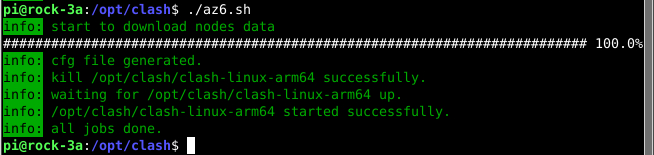

# 白嫖clash节点+生成配置文件+启动clash  (az6.sh)
目前在github上有很多用户分享爬取的免费节点，本项目的目的就是获取其他人仓库分享的节点来生成clash配置文件，并且启动clash。

## 使用说明
1. 安装依赖项目：[gojq](https://github.com/itchyny/gojq)，[clash](https://github.com/Dreamacro/clash)
2. 下载本仓库的az6.sh和template.yaml，赋予az6.sh可执行权限。
3. 按照自己的需求自定义az6.sh和template.yaml中的配置字段，然后执行az6.sh，看到下面的信息表示启动成功。

4. 把az6.sh加入到crontab中以实现定时启动，如下面内容可实现每天在04:02执行脚本

```2 4 * * *       /mypath/az6.sh &```

## 其他说明
- template.yaml的规则和版式可能比较陈旧了，如有需求请自行修改。
- 脚本会将ss(r)节点的cipher由chacha20改为xchacha20，ss的cipher:chacha20-poly1305改为chacha20-ietf-poly1305，h2/grpc network节点的tls:false改为true，因为这些节点不支持，会导致clash不启动。然而我没有测试这样改的节点是否能用。
